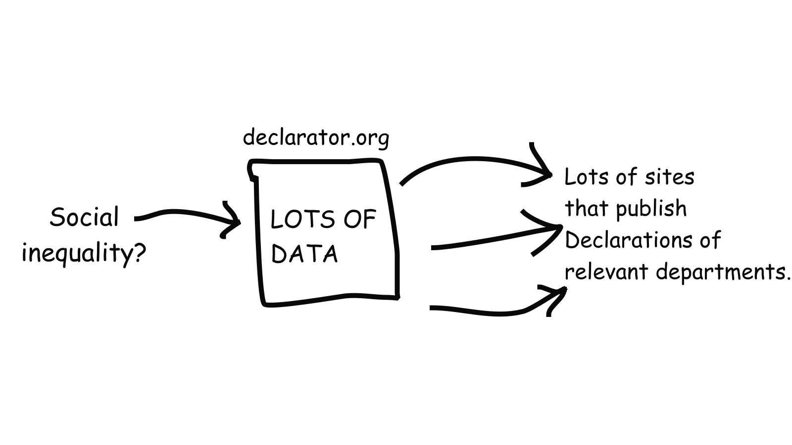

# DeputatExplorer

Существует ли социальное неравенство между чиновниками и обычными людьми? Выясним с помощью данных!



Мы предлагаем пройти небольшой тест.   
Ответьте на несколько простых вопросов и система выберет подходящего чиновника:
http://95.182.121.107/test/

Также посмотрите на карту. Чем краснее, тем сильнее отличаются доходы чиновников и доходы простых людей.
Её можно переключить в режим "Индекс роста региона". Тогда, чем синее, тем сильнее экономический рост.
http://95.182.121.107/map/

### Использованные данные

- declarator.org - доходы чиновников
- gks.ru - средние зарплаты по регионам
- fa.ru - экономический индекс роста
- google api - фотографии берём из гугла

### Как запустить

Нужно написать в env/prod.env хост/логин/пароль. Для dev-версии создаем env/dev.env
Пример:
```
MONGO_HOST=127.0.0.1:27017
MONGO_USERNAME=username
MONGO_PASSWORD=password
```

Нам потребуется docker:

Запустить всё (в терминале) - `docker-compose up`
Запустить всё (в detached-режиме) `docker-compose up -d`
Пересобрать всё - `docker-compose build`
Дев версия - `docker-compose -f docker-compose.dev.yml build`
Остановить всё - `docker-compose down`

Открыть в браузере: `http://localhost/test`

Проверить кодстайл:

```
npm init
npm install eslint --save-dev
npx eslint www/ --fix

python -m pylint flask/app.py --disable=missing-docstring --disable=consider-using-enumerate --disable=broad-except
```

Чтобы загрузить данные в локальную БД, качаем их отсюда:
https://declarator.org/media/dumps/declarations.json

Используем scripts/init_mongo.py для заполнения. 
Обратите внимание, внутрь скрипта нужно вписать данные по БД и путь к файлу.
